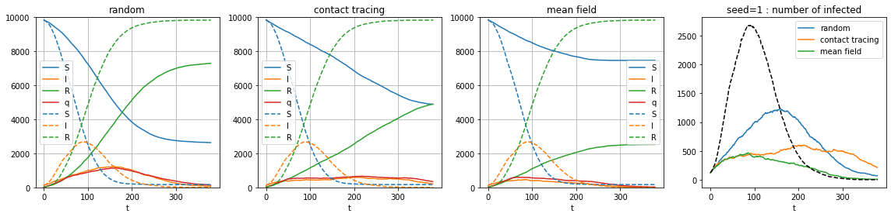

# Probabilistic inference framework for estimating risk of infection from proximity tracking data

We present a probabilistic inference framework based on mean field and belief propagation techniques for estimating risk of infection from proximity tracking data used in contact tracing. The algorithm, using the SIR inference model, is described in [these notes](https://www.overleaf.com/read/tfhcpbvhmcwq), where you can find more information about our approach.

## Demonstrations of the package and of the inference procedure can be found on these google colab notebooks:

- A set of demos and sanity checks: [Scatterplot](https://colab.research.google.com/drive/1QcK2ilzqRiE7bnHqrfxjHhXbwEs_12WU) compares the probabilities estimated by mean field and DMP with the frequencies obtained by Monte Carlo runs, showing the efficiency of the algorithm in sampling.

- [Demo 1](https://colab.research.google.com/drive/15qClUFJl_mWTVL6e2VG9mgsAgRQ9Armb) and [Demo 2](https://colab.research.google.com/drive/1DJP-8rYwjJU9p63HUYpiDYlod3riJvJs) are basic comparisons of the efficiency between choosing subjects to test via contact tracing, random sampling and with the inference approach.

- [Demo 3](https://colab.research.google.com/drive/1pRq13j8o6Y8GRWa_IDb_Erj-jqyjWDnM#scrollTo=bVi7bEAGgijX) compares the efficiency of quarantine  strategies using contact tracing and mean-field inference in simple SIR models. It was used to generate the image shown above.

- [Demo 4](https://colab.research.google.com/drive/1TxwzU59qPBAvk8X-X5Ft21C6nVW7c_pO) is another such demonstration ran on  large realistic networks generated by the agent-based model developed by the Pathogen Dynamics group in the Big Data Institute of Oxford.

## Presentations and slides

- Lenka Zdeborova presented this work online at the "ELLIS against Covid-19" [event](https://ellis.eu/en/covid-19/events/ellis-against-covid-19-06-05-2020) on May 6, 2020, [see slides](Ellis_talk.pdf) or [the talk on youtube](https://www.youtube.com/watch?v=weaRmSVA3yM&t=96m10s)

## Authors

[Antoine Baker](mailto:antoinebaker59@gmail.com), [Florent Krzakala](mailto:florent.krzakala@gmail.com), [Marc Mézard](mailto:marc.mezard@gmail.com), [Stefano Sarao Mannelli](mailto:stefano.sarao@gmail.com), [Maria Refinetti](mailto:mariaref@gmail.com) and [Lenka Zdeborová](mailto:lenka.zdeborova@gmail.com)
