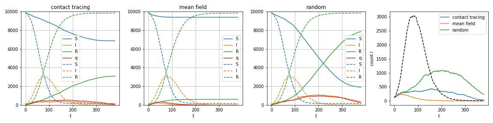

# Probabilistic inference framework for estimating risk of infection from proximity tracking data

We present a probabilistic inference framework based on mean field and beleif propagation technics for estimating risk of infection from proximity tracking data used in contact-tracing. The algorithm,  using the SIR inference model, is described in [these notes](https://www.overleaf.com/read/tfhcpbvhmcwq), where you can find more information about our approach.

Simple demonstration of the package and of the inference procedure can be found on these google colab notebooks:

- [Demo 1](https://colab.research.google.com/drive/15qClUFJl_mWTVL6e2VG9mgsAgRQ9Armb)

- [Demo 2](https://colab.research.google.com/drive/1DJP-8rYwjJU9p63HUYpiDYlod3riJvJs)

- See [Scatterplot](https://colab.research.google.com/drive/1QcK2ilzqRiE7bnHqrfxjHhXbwEs_12WU) for a sanity check comparing the probabilities estimated by mean field / DMP to the frequencies obtained by Monte Carlo runs.

Antoine Baker, Florent Krzakala, Marc Mézard, Stefano Sarao Mannelli, Maria Refinetti, Lenka Zdeborová
